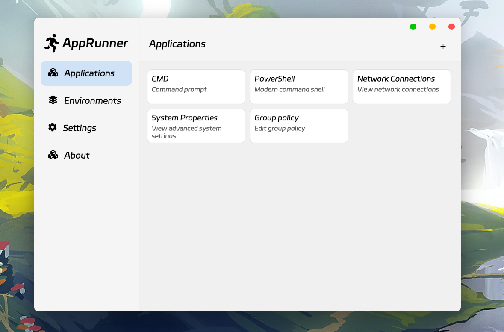

# AppRunner

_✨ Customize environment variables, file maps, and use them to launch applications on the fly. ✨_
  

  

## Features

- Customize environment variables.
- Customize file mapping. Make the application actually operate on another specified file when reading or writing a certain file.

## Preview

